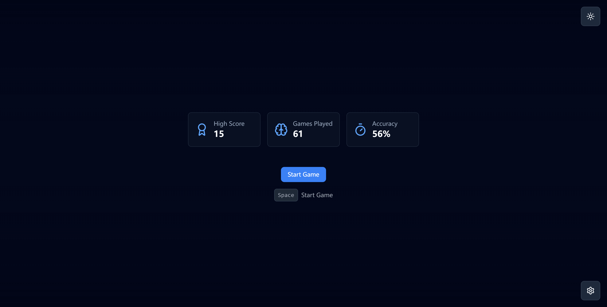
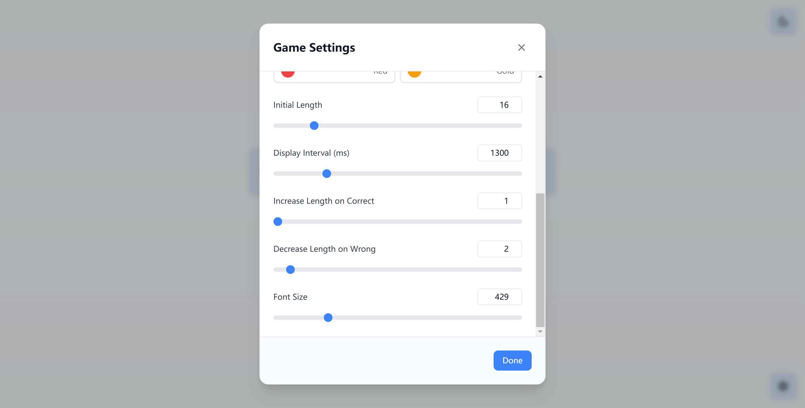

# Imem

A modern memory training game that helps you improve your ability to remember sequences of random numbers. Built with
React and featuring a clean, responsive interface with customizable settings and dark mode support.

## 🚀 Demo

Try the live demo at: [https://www.feh2.im/imem/](https://www.feh2.im/imem/)

# Preview







## ✨ Features

- 📱 Responsive design that works on both desktop and mobile
- 🌓 Light & Dark mode support
- ⚙️ Customizable game settings:
    - Number sequence length
    - Display interval
    - Font styles and sizes
    - Difficulty progression
- 📊 Performance tracking with statistics
- ⌨️ Full keyboard support
- 🎯 Progressive difficulty system
- 💾 Automatic progress saving

## 🛠️ Installation

1. Clone the repository:

```bash
git clone https://github.com/imfeh2/imem.git
cd imem
```

2. Install dependencies:

```bash
npm install
```

3. Start the development server:

```bash
npm run dev
```

4. Build for production:

```bash
npm run build
```

## 💻 Technologies Used

- **React 18** - Frontend framework
- **Tailwind CSS** - Styling
- **Lucide Icons** - UI icons
- **LocalStorage** - Game state persistence
- **Vite** - Build tool and development server

## 🎮 How to Play

1. Click "Start Game" or press Enter / Space to begin
2. A sequence of numbers will be displayed one at a time
3. Remember the sequence
4. Input the numbers in the correct order
5. If correct, the sequence length increases
6. If incorrect, the sequence length decreases

## ⚙️ Game Settings

You can customize various aspects of the game:

- **Initial Length**: Starting sequence length
- **Display Interval**: Time each number is shown
- **Increase By**: Length increase on correct answer
- **Decrease By**: Length decrease on wrong answer
- **Font Size**: Size of displayed numbers
- **Font Style**: Choose from various number display styles

## 🤝 Contributing

Contributions are welcome! Here's how you can help:

1. Fork the repository
2. Create a feature branch: `git checkout -b feature/amazing-feature`
3. Commit your changes: `git commit -m 'Add amazing feature'`
4. Push to the branch: `git push origin feature/amazing-feature`
5. Open a Pull Request

## 📝 License

This project is licensed under the Apache License 2.0 - see the [LICENSE](LICENSE) file for details.

## 🙏 Acknowledgments

- [Radix UI](https://www.radix-ui.com/) for accessible UI components
- [Tailwind CSS](https://tailwindcss.com/) for the utility-first CSS framework
- [Lucide](https://lucide.dev/) for the beautiful icons

## 📧 Contact

For questions or feedback, please reach out through:

- GitHub Issues
- Email: i@feh2.im
